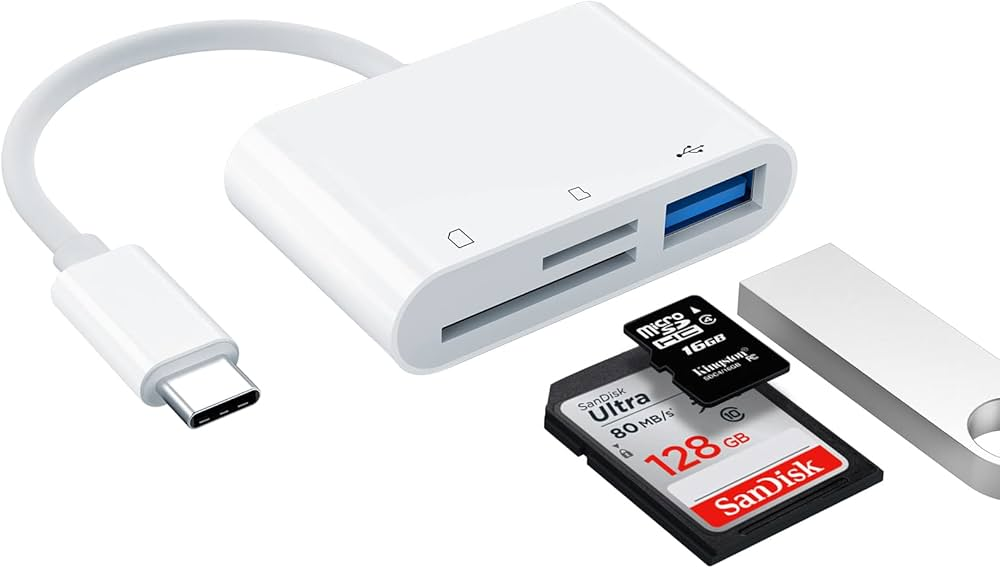

# 🍓 Prerequisites for Setting Up Raspberry Pi Zero 2 W

## 🔧 Hardware Requirements

### **Raspberry Pi Zero 2 W**
The main computing device.


### **MicroSD Card**
Any capacity is acceptable; however, it is recommended to use a high-capacity and high-speed (Class 10 or UHS-I/UHS-II) MicroSD card for optimal performance and reliability.

**Recommended:** Use the official Raspberry Pi-branded MicroSD card. Unlike general-purpose SD cards designed primarily for data storage, the Raspberry Pi SD card is optimized for running operating systems and handling frequent read/write cycles, offering better durability and performance specifically for Raspberry Pi use cases.


### **MicroSD Card Reader**
A modern, high-speed card reader is preferred to reduce errors and speed up the process of writing the OS image to the MicroSD card.


### **Micro USB Cable (Data & Power Supported) and a Power Brick**
A **Micro USB cable** is required to power the Raspberry Pi Zero 2 W and optionally enable data communication (e.g., for USB gadget mode). Ensure the cable supports **both power and data**, as many low-quality or charging-only cables lack data lines. 

Additionally, use a reliable **5V power adapter** (power brick) capable of supplying at least **2.5A** to ensure stable operation, especially if peripherals are connected.


### **(Optional) Male-to-Male Jumper Wire**
Useful for implementing a safe shutdown mechanism for the Raspberry Pi via GPIO. This can be used to physically trigger shutdown scripts or to short specific pins for controlled power-off.


### **(Optional) Heat Sink**
Recommended for thermal management. The Raspberry Pi Zero 2 W can become warm under heavy loads, so attaching a small heat sink helps maintain optimal operating temperatures, improving stability and prolonging the lifespan of the device.


---

## 💻 Software Requirements 

- **Raspberry Pi Imager** (recommended) or any other disk imaging tool (e.g., Rufus)  
    Used to write the Raspberry Pi OS image onto the MicroSD card.
    
- **Raspberry Pi OS Image**  
    Obtain the latest ISO or image file of the Raspberry Pi OS for installation.

---

# 🚀 Raspberry Pi Imager to flash Raspberry Pi OS in Raspberry Pi 

To flash the Raspberry Pi OS onto your MicroSD card, you will need the Raspberry Pi Imager tool. Follow the steps below to download and install it:

### Step 1: Search for Raspberry Pi Imager
Open your web browser and go to Google. Search for **"Raspberry Pi Imager"**.


### Step 2: Visit the Official Raspberry Pi Website
In the search results, click the link that leads to the official Raspberry Pi website:  
👉 [https://www.raspberrypi.com](https://www.raspberrypi.com)

### Step 3: Download the Imager
Scroll down on the page to find the **Raspberry Pi Imager** section. Download the version that matches your operating system:

- **Download for Windows**  
    
- **Download for macOS**
    

### Step 4: Install the Imager
Once the file is downloaded, run the installer and follow the on-screen instructions to complete the installation.


### Step 5: Launch Raspberry Pi Imager
After installation, open the **Raspberry Pi Imager** application.

### Step 6: Select Your Raspberry Pi Device
Click on the **"CHOOSE DEVICE"** option.

- If you're unsure, you can select **"No Filtering"** to view all supported Raspberry Pi models.
    
- Alternatively, directly select your device, e.g., **Raspberry Pi Zero 2 W**.

### Step 7: Select Operating System
Click on the **"CHOOSE OS"** button.

- Scroll down and select **"Use Custom"**.
    
- Then browse to the location where you saved your Raspberry Pi OS image file (usually `.img` or `.iso` format), and select it.
    

> **📝 Note:**  
> If you haven't downloaded the Raspberry Pi OS image yet, follow these steps:
> 
> 1. Open your browser and search for **"Raspberry Pi OS"**.
> 2. Visit the official Raspberry Pi OS page:  
>     👉 [https://www.raspberrypi.com/software/operating-systems/](https://www.raspberrypi.com/software/operating-systems/)
>     
> 3. Choose the version appropriate for your board.  
>     For this guide, we will use the **Raspberry Pi OS Legacy (64-bit)** version.
>     
>     
> 4. After downloading the OS file, extract it using a tool like **PeaZip** or **7-Zip**, as the downloaded file will be in `.xz` format.  
>     Extracting will convert it to a usable `.img` or `.iso` file for flashing.
>     
>     

### Step 8: Select Storage Device
Insert the MicroSD card into your computer using a card reader.

- Click **"CHOOSE STORAGE"** in the imager.
    
- Select the correct storage device (your MicroSD card) from the list.  
    ⚠️ **Double-check** that you've selected the correct drive to avoid overwriting other data.

### Step 9: Customize OS Settings
Click **"Next"** and then choose **"Edit Settings"** when prompted.


#### **General Tab:**

- **Set username and password**.
- **Configure Wi-Fi**:
    - Add your **SSID** and **Wi-Fi password**.
    - ⚠️ **Important**: Raspberry Pi Zero 2 W supports **2.4GHz Wi-Fi only**.
- **Set your time zone** to ensure accurate time logs.

#### **Services Tab:**
- Enable **SSH**.
- Select **"Allow public-key authentication only"** (more secure).
    

##### **To add a public SSH key in Windows:**
1. Open File Explorer and go to your user folder: `C:\Users\YourUsername\`
2. Enable **hidden files**.
3. Open the `.ssh` folder.
4. Look for a file ending in `.pub`. If none exists:
    - Open Command Prompt and run:
        ```
        ssh-keygen -t rsa -b 4096 -f %USERPROFILE%\.ssh\id_rsa
        ```
    - Press Enter for the next 2–3 prompts.
        
    - This will generate the `.pub` file.
5. Open the `.pub` file with Notepad.
6. Copy its contents and paste it into the **public key** field in Raspberry Pi Imager.


#### **Options Tab:**
- Check:
    - ✅ Play sound when finished
    - ✅ Eject media when finished
- Uncheck:
    - ❌ Enable telemetry

Click **Save** when done.


### Step 10: Confirm and Flash
1. The Imager will ask: "Would you like to apply OS customization settings?"  
    → Click **Yes**.
2. Confirm with "Are you sure?"  
    → Click **Yes** again.

The flashing process will begin. It may take a few minutes.
- Once complete, you'll hear a **beep sound** indicating the microSD card is ready to use.

---

# 🔌 Booting Raspberry Pi Zero 2 W (**headless mode**)

### Step 1: Insert the MicroSD Card
Remove the microSD card from your computer or card reader and insert it into the **microSD slot** on the Raspberry Pi Zero 2 W.

### Step 2: Connect the Micro USB Cable
Plug a **Micro USB cable** into one of the Raspberry Pi's Micro USB ports.

> 🔌 **Important:**  
> While either port can be used for power, **only the Micro USB port closest to the Micro HDMI port supports data transfer** (USB OTG).  
> Use this port if you plan to connect peripherals like keyboards, Ethernet adapters, or USB drives.

### Step 3: Power On the Raspberry Pi
Connect the other end of the Micro USB cable to a **5V power adapter** and turn it on.

### Step 4: Wait for Boot
The Raspberry Pi will power up and begin booting from the microSD card.  
This process may take a minute or two on the first boot, especially if you've enabled OS customizations or SSH access.

> 🟢 You can confirm it's running by observing the activity LED on the Pi. If you're using SSH, wait a moment before scanning your network or attempting to log in.

---

## 🛠 Troubleshooting: Manual Wi-Fi Configuration (if Raspberry Pi Imager Fails)

If your Raspberry Pi Zero 2 W does **not connect to Wi-Fi** after flashing with Raspberry Pi Imager — or if the advanced options in Imager didn't save properly — you can manually configure Wi-Fi using the `wpa_supplicant.conf` method.

This is an alternative (fallback) setup used in **headless mode** (no screen or keyboard):

### ✅ Create `wpa_supplicant.conf` File (WPA/WPA2 Networks Only)
In the **boot** partition of the SD card (visible on Windows/macOS), create a new file called:
```
wpa_supplicant.conf
```


Paste the following configuration:
```conf
country=IN
ctrl_interface=DIR=/var/run/wpa_supplicant GROUP=netdev
update_config=1

network={
    ssid="YourNetworkSSID"
    psk="YourNetworkPassword"
    key_mgmt=WPA-PSK
}
```

> 🔧 **Replace:**
> - `IN` with your two-letter country code (e.g., `US`, `GB`, `DE`)
> - `"YourNetworkSSID"` with your actual Wi-Fi network name
> - `"YourNetworkPassword"` with your Wi-Fi password


### 🔐 Enable SSH Access
In the **same boot partition**, create an **empty file** named:
```
ssh
```
(No file extension, and leave it completely blank.)

This enables SSH on first boot.

### 🚀 Boot the Pi and Connect
1. Eject the SD card safely and insert it into the Raspberry Pi Zero 2 W.
2. Power on the Pi using a Micro USB cable and a 5V/2.5A power supply.
3. Wait about 60–90 seconds for the Pi to boot and connect to the network.
4. Then, try connecting via terminal or command prompt:

```bash
ssh pi@raspberrypi.local
```

> 💡 If `raspberrypi.local` doesn't work, use your router's admin panel or a network scanning app (like **Fing** or **Angry IP Scanner**) to find the Pi's IP address.

---

## 🔄 System Updates

Once you're connected to your Raspberry Pi via SSH, it's a good idea to update the system to ensure you have the latest security patches and software improvements.

### ✅ Step 1: Update the Package List
```bash
sudo apt update
```
This command fetches the latest list of available software and updates from the Raspberry Pi OS repositories.  
It **does not install** any updates yet.

### ✅ Step 2: Upgrade Installed Packages
```bash
sudo apt full-upgrade -y
```
This installs the newest versions of all installed packages, resolving any dependency changes automatically.  
It's more thorough than `apt upgrade`.

> 🛡️ **Tip:** The `-y` flag auto-confirms prompts. Omit it if you prefer to review changes before applying.

### ✅ Step 3 (Optional): Clean Up Unused Packages
```bash
sudo apt autoremove -y
```
Removes packages that were installed as dependencies but are no longer needed, helping free up space.

### ✅ Step 4: Reboot (if required)
Some updates (especially kernel or firmware updates) may require a reboot:
```bash
sudo reboot
```
Your Raspberry Pi will restart and apply any pending changes.